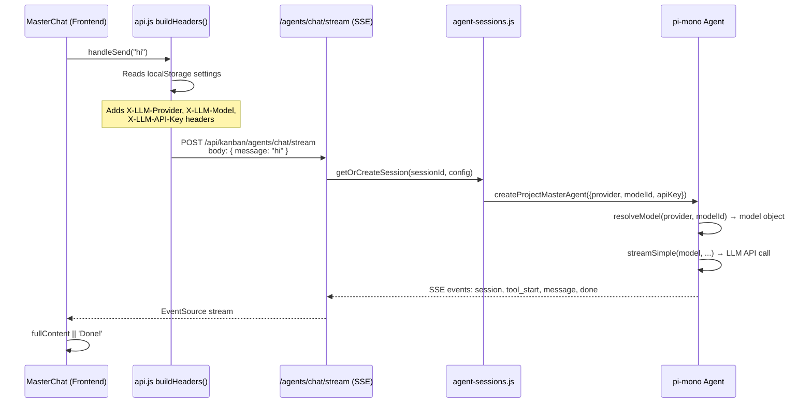

# MasterChat & Backend Crash — Walkthrough

## What MasterChat Does (data flow)



## Why "Done!" Appears

Line 120 of [MasterChat.jsx](file:///Users/mike/Project/GitHub/openphd/frontend/src/pages/kanban/components/chat/MasterChat.jsx#L120):

```js
actions.addMasterChat('assistant', fullContent || 'Done!', toolCalls, debugInfo)
```

`fullContent` stays empty when no `message` SSE event is received. This happens because:
1. The backend crashes (the `openai-chat` error kills the Node process)
2. The SSE connection breaks before any `message` event is emitted
3. The reader loop exits with `done: true`, `fullContent` is still `''`
4. Fallback fires → **"Done!"**

## Why the Backend Crashes

The crash chain:
1. `buildHeaders()` sends `X-LLM-Provider: openai` from your localStorage settings
2. `/agents/chat/stream` creates an agent session with `provider: 'openai'`
3. `createProjectMasterAgent` → `resolveModel('openai', modelId)`
4. `getModel('openai', modelId)` looks up the pi-ai model registry
5. If found, the registry model has `api: 'openai-chat'` — a string with **no registered provider** in this pi-ai version
6. `streamSimple(model)` → `resolveApiProvider('openai-chat')` → **💥 crash**

The valid API types in this pi-ai version: `anthropic-messages`, `openai-completions`, `openai-responses`, `google-generative-ai`, `bedrock-converse-stream`.

## Changes Made

### 1. File browser fix (from earlier)
render_diffs(file:///Users/mike/Project/GitHub/openphd/frontend/src/pages/kanban/components/onboarding/OnboardingWizard.jsx)

### 2. Console logging in [agents.js](file:///Users/mike/Project/GitHub/openphd/services/kanban/routes/agents.js)
- Logs every incoming `/agents/chat/stream` request: message, provider, model, apiKey (masked), baseUrl, sessionId
- Logs errors with stack traces

### 3. Guard + logging in [agent-engine.js](file:///Users/mike/Project/GitHub/openphd/services/kanban/lib/agent-engine.js)
- `resolveModel()` now overrides the `api` field if the registry model has a different api than `inferApi(provider)` expects
- Logs which model/api combo is being used

render_diffs(file:///Users/mike/Project/GitHub/openphd/services/kanban/routes/agents.js)
render_diffs(file:///Users/mike/Project/GitHub/openphd/services/kanban/lib/agent-engine.js)
