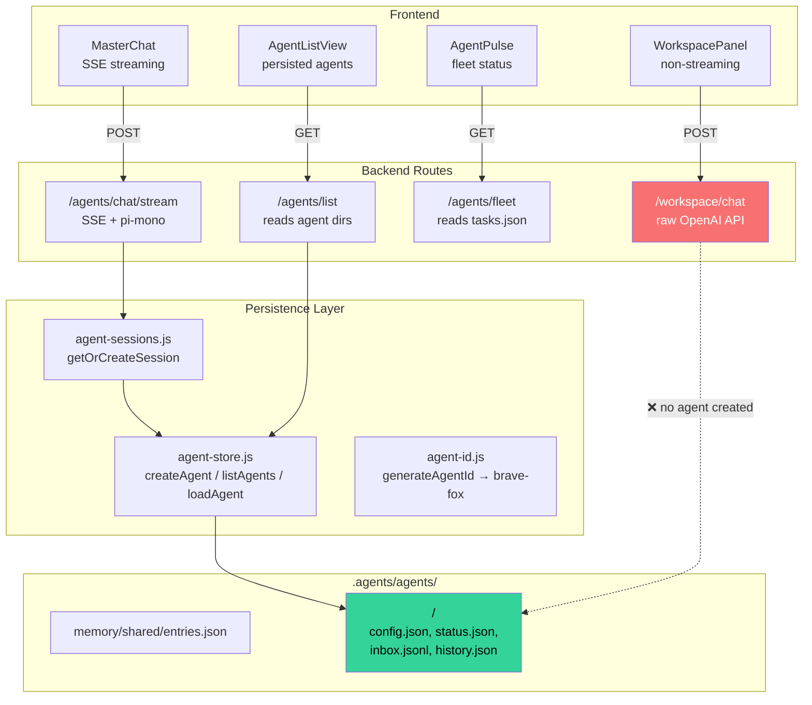

# Agent Architecture — Current State & Plan

## Current Architecture

## What Exists ✅

| Component | Status |
|-----------|--------|
| [agent-store.js](file:///Users/mike/Project/GitHub/openphd/services/kanban/lib/agent-store.js) | Complete — `createAgent`, `listAgents`, `loadAgent`, `deleteAgent`, `saveHistory` |
| [agent-id.js](file:///Users/mike/Project/GitHub/openphd/services/kanban/lib/agent-id.js) | Complete — `generateAgentId()` → `2026-02-24-11-35-21-brave-fox` |
| [agent-sessions.js](file:///Users/mike/Project/GitHub/openphd/services/kanban/lib/agent-sessions.js) | Mostly complete — calls `createAgentDir` on new sessions |
| `/agents/list` + `/agents/detail/:id` | Wired — reads from agent directories |
| [AgentListView](file:///Users/mike/Project/GitHub/openphd/frontend/src/pages/kanban/components/agents/AgentListView.jsx) | Complete — calls `/agents/list` and renders cards |
| [AgentPulse](file:///Users/mike/Project/GitHub/openphd/frontend/src/pages/kanban/components/agents/AgentPulse.jsx) | Complete — polls `/agents/fleet` |

## What's Broken ❌

### 1. MasterChat agents use UUIDs, not human-readable IDs
The `/agents/chat/stream` endpoint generates `crypto.randomUUID()` as the session ID → creates agent dirs named like `a3f8d1b6-0b3b-...`. The `generateAgentId()` system is never used.

### 2. WorkspacePanel doesn't create agents at all
[WorkspacePanel](file:///Users/mike/Project/GitHub/openphd/frontend/src/pages/kanban/components/detail/WorkspacePanel.jsx) calls `/workspace/chat` which uses raw `fetch()` to OpenAI — no pi-mono agent, no persistent folder, no agent store entry. Chat history is stored inside the issue's JSON, not in an agent directory.

### 3. WorkspacePanel asks user for a name (`prompt('Workspace name:')`)
Should auto-generate a two-word name from `agent-id.js`.

### 4. AgentPulse shows task counts from `tasks.json`, not actual agent count
The fleet stats don't reflect persisted agents from `agent-store`.

## Proposed Changes

---

### Backend — Agent Sessions

#### [MODIFY] [agent-sessions.js](file:///Users/mike/Project/GitHub/openphd/services/kanban/lib/agent-sessions.js)

- Use `generateAgentId()` instead of raw session UUIDs when creating new sessions
- The streaming endpoint should pass the generated ID back so the frontend knows it

---

### Backend — Workspace Agents

#### [MODIFY] [agents.js](file:///Users/mike/Project/GitHub/openphd/services/kanban/routes/agents.js)

- Add `POST /agents/create` endpoint that:
  1. Calls `createAgent({ type: 'workspace', workspace, ... })` with auto-generated ID
  2. Returns `{ agentId, displayName }` to the frontend
- Update `/agents/fleet` to include persisted agent count from `listAgents()`

---

### Frontend — WorkspacePanel

#### [MODIFY] [WorkspacePanel.jsx](file:///Users/mike/Project/GitHub/openphd/frontend/src/pages/kanban/components/detail/WorkspacePanel.jsx)

- Remove `prompt('Workspace name:')` — auto-generate name via `POST /agents/create`
- When creating workspace: call backend first to get `agentId` + `displayName`, then store in workspace obj
- Wire workspace chat to use the pi-mono SSE stream (`/agents/chat/stream`) with the workspace's `agentId` as session

---

### Frontend — AgentPulse

#### [MODIFY] [AgentPulse.jsx](file:///Users/mike/Project/GitHub/openphd/frontend/src/pages/kanban/components/agents/AgentPulse.jsx)

- Add "agents" count to fleet stats from `/agents/list`

## Verification Plan

1. Create a workspace from an issue → verify agent folder appears in `.agents/agents/`
2. Chat in the workspace → verify pi-mono SSE streaming works (not raw OpenAI)
3. Check Agents panel → verify the new agent shows with its `brave-fox` display name
4. Check AgentPulse → verify agent count is correct
